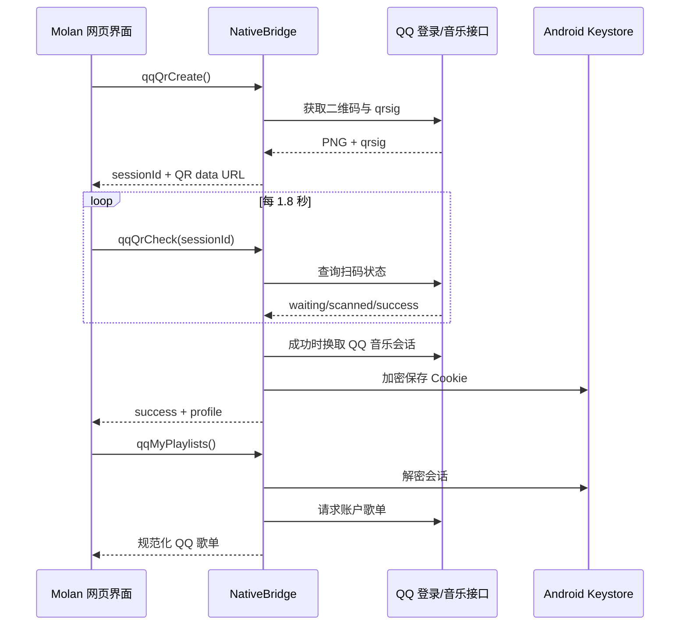

# Molan APK 内独立 QQ 登录设计

本设计不依赖用户自建后端。它参考 `l-1124/QQMusicApi` 的 QR 登录能力和 musiche 的 QR/Cookie 状态机，但不复制 QQMusicApi 的 GPL 源码；独立实现只需要的 Java 网络、会话与桥接层。musiche 的 Apache-2.0 实现只作为状态字段与交互流程参考。

> QQ 登录和用户歌单依赖 QQ 音乐 Web/客户端的非公开接口，随上游策略变化可能失效。此功能仅供用户本人登录自己的账号、读取个人歌单和播放有权收听的内容；不绕过会员、付费或版权限制。

## 设计原则

| 原则 | 实现 |
|---|---|
| 不依赖后端 | Android 原生层请求 QR 图片、轮询登录、读取账户和歌单 |
| Cookie 不暴露给网页 | WebView 只获得 QR 图、登录状态、资料与规范化歌单 JSON；原始 QQ Cookie 仅在 Java 内存和加密偏好中保存 |
| 本地加密保存 | Android Keystore 生成 AES-GCM 密钥；加密后的 Cookie 与 IV 存到私有 `SharedPreferences` |
| 会话最小化 | QR `qrsig` 只存内存并有短 TTL；登录 Cookie 仅保存维持 QQ 音乐登录所需字段 |
| 不保存音源 | 音源继续由 ChKSz `/api/qq_music?mid=...` 按需解析；不缓存或下载 QQ 流媒体到后端 |
| 独立源缓存 | QQ 账户、歌单和详情缓存使用 `qq:` 前缀，避免与网易云数字 ID 冲突 |

## 原生桥接契约

| JS → Android | 返回 | 说明 |
|---|---|---|
| `qqQrCreate()` | `{state, sessionId, qrImage}` | 原生请求 QR PNG，返回 data URL，不返回 `qrsig` |
| `qqQrCheck(sessionId)` | `{state: waiting\|scanned\|authorized\|success\|expired\|failed, profile?}` | 原生轮询并在成功时保存加密会话 |
| `qqAccount()` | `{loggedIn, profile?}` | 读取加密会话并验证当前 QQ 账户 |
| `qqMyPlaylists()` | `{state, playlists}` | 原生请求“我喜欢”和“我的歌单”，规范化返回 |
| `qqPlaylistDetail(id)` | `{state, playlist}` | 返回 QQ 歌单的标准曲目模型，曲目保留 `qqMid` |
| `qqLogout()` | `{ok}` | 删除 Keystore 加密的本地 QQ 会话 |

## 状态流

## 与 Molan 的数据模型

QQ 歌单使用 ID `qq:{dissid}`；网易云歌单使用 `ncm:{id}` 或现有缓存键。统一歌单对象包含 `source`、`sourceLabel`、`id`、`rawId`、`name`、`coverImgUrl`、`trackCount` 和 `creator`。QQ 曲目 `id` 取 `qq:{mid}`，并保留 `qqMid`；播放器遇到 QQ 曲目时调用 ChKSz 的 `qq_music` 解析端点，以共享 Molan 的统一音质设置和歌词缓存。
