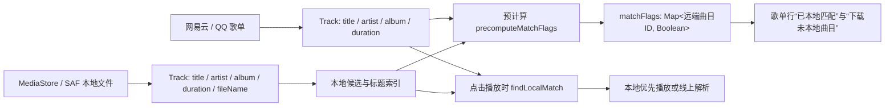

# 轻音 0.24 本地音乐—歌单曲目匹配问题深入分析报告

**分析对象：** `takereshui/qingyin` 当前 `main` 分支，重点审阅本地扫描、索引构建、线上歌单解析、匹配评分、匹配标记缓存和歌单详情展示链路。  
**分析方式：** 静态代码审阅与提交历史对比；本报告**没有修改任何匹配代码**，也没有在真机上取得某一首具体漏匹配歌曲的运行日志。因此，本文将结论区分为“代码直接证据”“高概率风险”和“需用样本验证的假设”。

> **核心判断：** 当前问题不应只被理解为“相似度阈值不够宽松”。系统实际上存在两套不同的“匹配真相”：播放时实时调用 `findLocalMatch()`，而歌单页面与“下载未本地曲目”按钮只读取异步预计算的 `matchFlags`。这两套结果可能不同；再叠加非原子状态写入、歌单刷新不重算旧标记、扫描候选不完整和严格的时长/文本门槛，就会表现为“有些本地文件明明存在，但歌单根本没有匹配上”。[1] [2] [3]

## 一、结论摘要

| 优先级 | 问题 | 证据级别 | 对用户现象的解释力 |
|---|---|---|---|
| P0 | **展示层 `matchFlags` 与播放层实时匹配脱节** | 代码直接证据 | 很高：歌单显示“未匹配”，但点击播放可能仍会本地优先。 |
| P0 | **`matchFlags` 存在并发读—改—写丢失更新风险** | 代码直接证据 | 很高：多列表/多次刷新同时预计算时，一部分曲目 ID 可能永远不在标记表中。 |
| P0 | **歌单刷新后按曲目 ID 复用旧标记，可能保留过期的 `false`** | 代码直接证据 | 很高：缓存歌单先显示、网络歌单后刷新时，元数据变了但同 ID 不会重算。 |
| P1 | **本地候选集合可能不完整或元数据陈旧** | 代码直接证据 | 高：未进入扫描候选的文件不可能被任何规则匹配。 |
| P1 | **匹配规则仍偏保守，尤其是时长门槛和元数据格式差异** | 代码直接证据 | 高：同曲不同母带、版本、文件名或艺人分隔符时容易被拒绝。 |
| P2 | **缺少匹配单元测试、端到端样本和拒绝原因诊断** | 代码直接证据 | 高：当前难以区分“没有候选”“候选被拒绝”与“结果未显示”。 |

## 二、当前匹配链路：并非一个函数，而是五段数据管线

本地文件来自两个入口。`LocalMusicRepository` 从 MediaStore 读取标题、艺人、专辑、时长和 `DISPLAY_NAME`；自定义 SAF 目录则使用 `MediaMetadataRetriever`，失败时以文件名作为标题，并保留原始文件名。[4] [5] 网易云歌单曲目则由 `name`、歌手数组、专辑名和 `dt/duration` 组成；QQ 歌单采用其自身字段与秒级时长换算。因此，进入匹配器前，两侧已经可能存在标题格式、艺人拼接、时长和文件名来源差异。[6]

随后，`rebuildLocalMatchIndex()` 异步建立本地标题索引；`precomputeMatchFlags()` 为当前展示的线上曲目异步生成 `Map<Track.id, Boolean>`；歌单 UI 仅使用这张 Map 作为状态来源。[1] [3] 但是在用户实际点击歌曲时，`playWithLocalPriority()` 和队列解析路径会重新调用 `findLocalMatch()`，并不以界面的 `matchFlags` 为准。[2]

这就是报告最重要的结构性发现：**“歌单显示未匹配”不等于“播放时无法匹配本地文件”。**

## 三、P0 根因：展示状态与播放决策使用了不同的匹配真相

歌单页的每一行使用 `matchFlags[track.id] == true` 来显示“已本地匹配”；同一张 Map 还被用于计算“下载未本地曲目”的数量。只要 Map 中缺少该 ID 或值为 `false`，UI 就把它当作未匹配。[3]

与之相对，用户点击播放时，`playWithLocalPriority()` 会直接调用 `findLocalMatch(track)`。队列当前曲目解析时也会再次调用同一个函数；如果存在匹配，就以本地队列播放，而不是走线上 URL。[2]

| 场景 | `matchFlags` | `findLocalMatch()` | 用户看到/感受到的结果 |
|---|---:|---:|---|
| A | `false` 或缺失 | 有匹配 | 歌单显示“未本地匹配”，但点击后可能实际播放本地文件。 |
| B | `true` | 有匹配 | 展示与播放一致。 |
| C | `false` 或缺失 | 无匹配 | 展示与播放都为未匹配。 |
| D | `true` | 本地库后续变化导致失效 | UI 可能短暂显示已匹配，但播放会退回线上。 |

> 因此，首先必须通过一首“UI 显示未匹配但本地文件确定存在”的歌曲做鉴别：**点击播放后，若出现“本地优先播放”或没有网络解析，则首要问题是 `matchFlags` 展示管线；若仍走线上解析，则才是候选扫描/匹配规则问题。**

## 四、P0 根因：`matchFlags` 的异步更新存在丢失更新风险

`precomputeMatchFlags()` 在后台线程筛选未计算目标，然后以如下模式写回状态：读取当前 Map，合并本批 `additions`，再整体赋值。多个协程如果同时读取到相同的旧 Map，后完成的协程可能覆盖先完成协程刚写入的条目。代码中没有互斥锁、原子 `update`，也没有按歌单会话或生成代次做提交保护。[1]

这是典型的 **read–modify–write lost update（读—改—写丢失更新）** 模式。例如：

| 时间 | 协程 A：每日推荐 | 协程 B：当前歌单 | Map 结果 |
|---|---|---|---|
| T1 | 读取 `{}` | 读取 `{}` | `{}` |
| T2 | 计算出 `{A=true}` | 计算出 `{B=true}` | `{}` |
| T3 | 写入 `{A=true}` | 尚未写入 | `{A=true}` |
| T4 | 基于旧快照写入 `{B=true}` | — | `{B=true}`，**A 丢失** |

本应用在本地索引重建后会同时调用搜索、每日推荐和当前歌单的 `precomputeMatchFlags()`；打开歌单、加载缓存歌单、刷新网络歌单也会触发新的预计算任务，因此并发并非理论情况。[1]

**影响：** 被覆盖的曲目 ID 在 UI 中等同于 `false`，会被计入“下载未本地曲目”，即使真实 `findLocalMatch()` 已经可以匹配。该问题尤其符合“有些根本没有匹配上，而且看起来不稳定”的描述。

## 五、P0 根因：缓存歌单刷新后不会因元数据变化重算已有标记

打开歌单时，应用优先将本地缓存详情放入 `_playlistDetail` 并计算标记；随后网络详情返回后，会再次调用 `precomputeMatchFlags(detail.tracks)`。[1] 但该函数只处理 `track.id !in _localMatchFlags.value` 的曲目。也就是说，如果缓存版本先为某个 `ncm:123` 写入 `false`，网络刷新后即使该曲目的标题、艺人、专辑或时长发生变化，仍因 ID 相同而跳过重算。[1] [6]

这在下列情况中会发生：远端曲目更正了艺人、专辑或时长；缓存来自旧歌单版本；后台解析把详情写回本地副本；本地媒体库发生变化但标记表尚未完成正确刷新。当前状态键只使用 `Track.id`，没有包含远端匹配字段版本或本地索引世代。

**影响：** 用户刷新歌单后可能仍看到旧的未匹配结果，造成“明明文件/歌单已经对上，仍然不匹配”的印象。

## 六、P1 根因：本地扫描候选不完整或元数据可长期陈旧

### 6.1 MediaStore 只纳入系统标记为音乐的文件

MediaStore 扫描条件要求 `IS_MUSIC != 0`、时长大于 0、大小大于 0。[4] 某些下载器、文件管理器、旧文件或存储卡中的音频可能未被系统媒体库标记为音乐；它们即便位于设备中，也不会进入 `_localTracks`。如果用户未把对应文件夹加入 SAF 自定义目录，匹配器根本看不到这些文件。

### 6.2 自定义目录扫描依赖持久 URI 权限与扩展名/MIME 判断

SAF 扫描仅遍历用户授权的树目录，且只接受 MIME 以 `audio/` 开头或列出的音频扩展名；权限失效、未选中上级目录、使用未列出的格式，都会让本地文件缺席。[5]

### 6.3 增量复用只以 URI 为键，不检测元数据版本

MediaStore 和 SAF 扫描均会复用 URI 未变化的旧 `Track`。SAF 逻辑尤其明确：同一 URI 已存在就不再重新运行 `MediaMetadataRetriever`。[4] [5] 如果用户覆盖了同路径文件、修正了 ID3 标签、移动后系统继续复用同一文档 URI，或旧缓存含有“未知歌手”，应用可能长期使用旧标题、旧艺人和旧时长参与匹配。

> 这类问题的特点是：同一文件在其他播放器中标签已经正确，但轻音本地页显示旧信息；手动重新扫描后也未必改善，因为 URI 命中缓存仍会复用。

## 七、P1 根因：匹配器仍然是保守策略，存在多处系统性漏配点

`TrackMatcher` 明确将“避免误播”置于“提高召回率”之前。该设计对同名歌曲是必要的，但也会导致歌单同步场景的召回率偏低。[7]

| 规则 | 当前行为 | 易漏配的真实场景 |
|---|---|---|
| 时长硬门槛 | 只要两侧时长差超过 3 秒，直接拒绝，不再比较标题/艺人。 | Live、Intro、Outro、母带版、不同平台裁剪版、文件包含静音尾部。 |
| 标题初筛 | 标题最高相似度低于 70 分立即拒绝。 | 远端带副标题、本地带歌手前缀、中文/英文副名、不同括号标注。 |
| 艺人要求 | 变体、文件名、模糊匹配多数情况下都要求艺人相似度至少 70。 | 本地标签为“未知歌手”、艺人排序相反、多人合作格式不同、`×`、中文“与/、”、乐队名别名。 |
| 文件名规则 | 分隔符拆分后优先将最后一段当标题。 | 文件名采用“歌名 - 歌手”而非“歌手 - 歌名”时，最后一段恰好是歌手。 |
| 标题规范化 | 处理部分标点、括号与有限简繁字，但没有转写、别名表、全量繁简转换和语义版本识别。 | 罗马音与中文名、译名、艺人别名、拼音文件名。 |

尤其需要注意：时长门槛发生在所有文本评分之前。即使标题和艺人完全相同，只要平台时长差超过 3 秒，也会直接返回 `null`。[7] 这不是 UI 延迟，而是确定性的算法拒绝。

## 八、P1 根因：索引优化与全量评分兜底之间存在性能—一致性拉扯

0.24 之前的优化把索引构建移到 `Dispatchers.Default`，避免大音乐库在主线程执行 `indexKeys()`；该提交也引入了索引世代守卫与重建完成后的回填动作。[8] 这是合理的性能优化，但它让匹配结果从“同步、当前时刻的计算”变为“异步索引 + 异步预计算标记”。

当前代码在标题索引没有共同键时，会再退回到全量候选集进行严格评分，这提升了召回率；但该补救发生在后台任务中，且没有任何日志告知某曲目走了“索引命中”“全量兜底”“时长拒绝”“艺人拒绝”中的哪一条路径。[1] [7]

因此，现状不是无法匹配，而是**匹配过程不可观测**：用户只能看到最终勾选或未勾选，开发者无法从应用界面区分是扫描漏项、缓存陈旧、索引漏键、严格规则拒绝，还是异步标记丢失。

## 九、为什么此前“放宽时长 + 全量兜底”仍可能不能解决问题

近期修复已将时长容差从 0.5 秒改为 3 秒，并在索引未命中时加入严格全量评分。这能够修复一部分明显的标题/时长变体，但不会处理以下问题：

1. **标记异步丢失。** `findLocalMatch()` 可能返回成功，但 UI 表仍没有该 ID；调整评分不会改变这一点。
2. **本地候选不存在。** 文件没被 MediaStore 或 SAF 扫描进来时，全量评分仍是空集。
3. **远端与本地元数据差异超过规则边界。** 例如时长差大于 3 秒、歌名和文件名顺序相反、艺人格式高度不同。
4. **旧缓存标记没有按新元数据失效。** 同一个远端 ID 的旧 `false` 会抑制重算。
5. **没有测试与可观测性。** 修复只能凭个别歌曲主观验证，难以发现回归或判断该调阈值还是调数据源。

## 十、建议的验证路径（不改变代码即可执行）

### 10.1 先区分“显示问题”与“真实匹配失败”

选 5 首歌单中显示未匹配、但确认设备有本地文件的歌曲，逐首点击播放并记录结果。

| 观察结果 | 更可能的根因 | 后续调查方向 |
|---|---|---|
| 点击后明确本地播放，或无需网络仍能播放 | `matchFlags` 预计算/展示状态错误 | 并发写入、缓存失效、刷新时机。 |
| 点击后仍请求网易云/QQ URL | 扫描候选缺失或规则拒绝 | 本地扫描结果、标题/艺人/时长、规则拒绝原因。 |
| 有时本地、有时线上 | 异步索引/标记竞态或缓存不一致 | 状态生成代次、预计算任务顺序、扫描结束时机。 |

### 10.2 为每首漏配样本采集最小证据集

无需提供音频文件。每首歌只需记录：歌单来源、线上标题/艺人/专辑/时长、本地页标题/艺人/专辑/时长/文件名、是否经 MediaStore 或自定义目录扫描、首次打开与刷新后的显示、点击后的实际播放渠道。

| 字段 | 示例 | 作用 |
|---|---|---|
| 线上曲目 | 标题、艺人、专辑、时长 | 判断远端元数据格式。 |
| 本地曲目 | 标题、艺人、专辑、时长、文件名 | 判断扫描是否读到正确标签。 |
| 来源 | MediaStore / SAF | 判断是否属于扫描候选缺失。 |
| 结果 | UI 勾选、点击播放渠道 | 区分展示问题与匹配算法问题。 |

### 10.3 必须补齐的测试矩阵

当前工程只有歌词解析测试，没有 `TrackMatcher`、本地扫描或歌单标记的自动化测试。这意味着任何阈值或异步优化都无法被回归验证。[9]

建议未来以固定测试样本覆盖：完全一致、时长差 1/3/5 秒、歌手—歌名与歌名—歌手文件名、未知艺人、多人合作、括号版本、简繁体、同名不同歌手、缓存歌单刷新、并发预计算、MediaStore 缺失而 SAF 存在等情形。测试目标不只是“能匹配”，还应验证“不会把同名不同版本误配”。

## 十一、建议的后续修复顺序（仅建议，本报告未执行）

> **建议先修状态一致性和可观测性，再继续放宽文本规则。** 直接继续调低阈值会提高误配风险，却不能解决 `matchFlags` 丢失或本地候选未扫描的问题。

| 顺序 | 建议方向 | 预期收益 | 风险控制 |
|---|---|---|---|
| 1 | 统一 UI 与播放的匹配结果来源，或让 UI 在点击路径复用同一结果。 | 消除“显示不匹配、实际本地播放”的矛盾。 | 结果需携带本地索引世代。 |
| 2 | 将 `matchFlags` 改为原子合并，并按歌单/索引 generation 提交。 | 消除并发覆盖和陈旧异步结果。 | 使用不可变 Map 的原子更新或单一串行 worker。 |
| 3 | 标记缓存键加入远端元数据指纹与本地索引 generation。 | 歌单刷新、改标签、重扫后可正确重算。 | 避免只以 `Track.id` 缓存真值。 |
| 4 | 增加“为什么未匹配”的诊断信息。 | 一次真机样本即可定位扫描、索引或规则问题。 | 仅在调试/诊断开关输出，避免生产性能负担。 |
| 5 | 基于真实漏配样本精细调整规则。 | 提升召回率而不盲目误配。 | 保持同名不同歌手、不同版本的保护条件。 |

## 十二、最终判断

当前“本地匹配有些根本没有匹配上”的最可疑主因是：**异步预计算标记表并不可靠地代表实时匹配结果**。它存在并发覆盖、按 ID 复用旧 `false`、后台索引完成前后的时序差异；而歌单页面和批量下载按钮完全依赖它。[1] [3] 这是比“相似度算法太严格”更优先的问题。

其次，本地候选集的来源与元数据质量不受匹配器控制：MediaStore 的 `IS_MUSIC` 过滤、SAF 授权、URI 级缓存复用、标签读取失败和不同平台元数据格式，都可能让同一首实际存在的文件不具备可匹配的字段。[4] [5] 在这些前提未被验证前，继续单纯放宽阈值只能缓解部分曲目，并可能增加误匹配。

**建议下一步先采集 5 首具体漏配样本并对照第十节的观察表。** 如果“点击播放能本地优先而 UI 没勾选”的比例高，优先处理状态一致性；如果点击也走线上，则按扫描候选、时长门槛、标题/艺人规则逐项诊断。

## References

[1]: https://github.com/takereshui/qingyin/blob/ff47b45/native-android/app/src/main/java/im/molan/music/MainViewModel.kt "MainViewModel：本地索引、预计算标记与本地优先播放"
[2]: https://github.com/takereshui/qingyin/blob/ff47b45/native-android/app/src/main/java/im/molan/music/MainViewModel.kt#L577-L634 "MainViewModel：队列解析与点击播放的实时本地匹配"
[3]: https://github.com/takereshui/qingyin/blob/ff47b45/native-android/app/src/main/java/im/molan/music/Screens.kt#L390-L452 "Screens：歌单详情页的 matchFlags 展示与下载计数"
[4]: https://github.com/takereshui/qingyin/blob/ff47b45/native-android/app/src/main/java/im/molan/music/data/local/LocalMusicRepository.kt "LocalMusicRepository：MediaStore 扫描和本地索引缓存"
[5]: https://github.com/takereshui/qingyin/blob/ff47b45/native-android/app/src/main/java/im/molan/music/data/local/CustomFolderRepository.kt "CustomFolderRepository：SAF 扫描和元数据提取"
[6]: https://github.com/takereshui/qingyin/blob/ff47b45/native-android/app/src/main/java/im/molan/music/data/network/NcmRepository.kt#L283-L313 "NcmRepository：线上歌单曲目元数据映射"
[7]: https://github.com/takereshui/qingyin/blob/ff47b45/native-android/app/src/main/java/im/molan/music/data/match/TrackMatcher.kt "TrackMatcher：标题、艺人、时长与接受阈值"
[8]: https://github.com/takereshui/qingyin/commit/096d589fa80739da87918dfb2f85eeda8519fe73 "扫描提速：自定义目录并行提取与匹配索引后台重建"
[9]: https://github.com/takereshui/qingyin/tree/ff47b45/native-android/app/src/test "当前单元测试目录"
